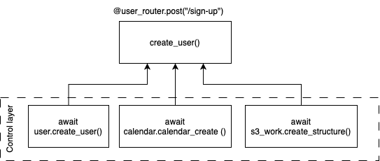

# Концепции работы backend SeaWolves

Элементы backend SeaWolves:
* FastAPI – backend framework.
* SQLAlchemy – ORM система.
* PostgreSQL – СУБД.
* boto3 – AWS S3 SDK.
* unicorn – async WSGI server.

## Как работает движок SeaWolves

Движок SeaWolves выполнен на FastAPI (Starlet + Pydantic), а бизнеслогика его работы разделена по слоям:
* [Route](#route-слой) – самый верхний слой. В нём реализована логика работы с HTTP-запросами. Route-слой состоит 
  из набора ендпоинтов и правил роутинга.  
* [Control](#control-слой) – средний слой. В нём реализована основная логика работы движка: работа с условиями, исключениями, вызов 
  сторонних функций. 
* [DAL](#dal-слой) – самый низкий слой. В нём реализована работа с базой данных – ООП ORM SQL-запросы к СУБД.

### Route-слой

Ендпоинты (URL) разделены по группам через создание разных инстансов класса `APIRouter()`. Например роутинг 
ендпоинтов по работе с пользователями выглядит так:
```python
from fastapi import APIRouter, Depends
from models.pydantic_models import AcceptedUserRegistration, UserRegestrationModel

from controls.user.User_controls import UserControl
from controls.calendar.Calendar_controls import CalendarControl
from db.session import get_db
from db.user.User_DAL import UserDAL
from db.calendar.Calendar_DAL import Calendar_DAL
from modules.S3.s3 import S3, s3_session

s3_con = s3_session
s3_work = S3(session=s3_con, s3_conf_path='./modules/S3/S3_structure.cfg')
user_router = APIRouter()
user_dal = UserDAL(db_session=get_db)
calendar_dal = Calendar_DAL(db_session=get_db)
user = UserControl(db_connection=get_db, user_dal=user_dal)
calendar = CalendarControl(db_connection=get_db, calendar_dal=calendar_dal)

@user_router.post("/sign-up", response_model=AcceptedUserRegistration)
async def create_user(user_reg_data: UserRegestrationModel = Depends(UserRegestrationModel)) -> AcceptedUserRegistration:
    new_user = await user.create_user(nick_name=user_reg_data.nick_name, email=user_reg_data.email, password=user_reg_data.hashed_password)
    await calendar.calendar_create(user_id=new_user['id'], calendar_name=user_reg_data.nick_name + '\'s calendar' )
    await s3_work.create_structure(bucket_name='seausers', structure_name='sea_user', id=new_user['id'])
    return new_user
...
```

Rout-функции определяют:
* поля форм ендпоинтов (`user_reg_data: UserRegestrationModel = Depends(UserRegestrationModel)`).
* структуру ответа `response_model=AcceptedUserRegistration`.
* вызываемые внутри них control- и module-функции (модули расширяющие функционал движка, например, S3).

Схематично работа rout-функций выглядит так:




Далее инстанс `user_router` подключается к root-роутеру в main-файле проекта FastAPI:
```python
from fastapi import FastAPI, APIRouter
import uvicorn
from routers.user_router import user_router

main_api_router = APIRouter()
app = FastAPI()

main_api_router.include_router(user_router, prefix="/user", tags=["user"])
app.include_router(main_api_router)

if __name__ == "__main__":
    uvicorn.run("main:app", host="localhost", port=8003, reload=True)
```

### Control-слой

Control слой реализует основную бизнеслогику. В control-функциях происходят вызовы DAL-функций, обработка полученных 
данных и поднятие FastAPI исключений `HTTPException`. `Contorl`- и `DAL`-функции обычно называются одинаково, чтобы 
было просто найти пайплайн исполнения задачи. Например, `Contorl`- и `DAL`-функции регистрация пользователя выглядят 
так:

| DAL-функция | Control-функция |
|---|---|

|
```python
async def create(self, new_user_nick_name: str, new_user_email: str, new_user_password: str) -> AcceptedUserRegistration:
    new_user = UserRegestrationModel(nick_name=new_user_nick_name, email=new_user_email, hashed_password=new_user_password)
    request = insert(Seauser).values(nick_name=new_user.nick_name, email=new_user.email, hashed_password=new_user.hashed_password).returning(Seauser)
    action = await self.db_session.execute(request)
    out = await sql_return_parser(sql_return=action, output_model=AcceptedUserRegistration)
    return out
```
|

```python
async def create_user(self, nick_name:str, email: str, password: str) -> AcceptedUserRegistration:
    try:
        async with self.db_connection() as session:
            self.user_dal.db_session = session
            action = await self.user_dal.create(new_user_nick_name=nick_name, new_user_email=email, new_user_password=password)
            return action

    except IntegrityError as e:
        if f"DETAIL:  Key (email)=({email}) already exists." in str(e):
            raise HTTPException(status_code=400, detail="User with this email already exists.")
        if f"DETAIL:  Key (nick_name)=({nick_name}) already exists." in str(e):
            raise HTTPException(status_code=400, detail="User with this nick_name already exists.")
        else:
            raise HTTPException(status_code=500, detail="Unexpected error occurred.")
```
|

Из примера видно, что в `create_user` мы вызываем функцию `user_dal.create` класса `UserDAL`, передав в него 
асинхронную сессию `session`. Сессию мы получаем через вызов функции `get_db`:
```python
from typing import Generator
from contextlib import asynccontextmanager
from sqlalchemy.ext.asyncio import AsyncSession
from sqlalchemy.orm import sessionmaker

async_session = sessionmaker(engine, expire_on_commit=False, class_=AsyncSession)

@asynccontextmanager
async def get_db() -> Generator:
    """Dependency for getting async session"""
    try:
        session: AsyncSession = async_session()
        yield session
    finally:
        await session.close()
```

Важно, что при ошибках поднимаются исключения 400 группы ошибок – это ошибки валидации данных на уровне 
Pydantic-моделей, что говорит пользователю о том, что он ошибся и может исправить ошибку.

### DAL-слой

DAL-слой – это самый нижний слой работы приложения, который отвечает за работу с БД через ORM-систему SQLAlchemy. 
Принцип работы DAL-функций такой: 
1. Создаётся инстанс Pydantic-модели представляющей поля ендпоинта – нужен для валидации данных полей. Например, 
   `UserRegestrationModel(nick_name=new_user_nick_name, email=new_user_email, hashed_password=new_user_password)`;
2. Формируется SQL-запрос. Например, `insert(Seauser).values(nick_name=new_user.nick_name, email=new_user.email, 
   hashed_password=new_user.hashed_password).returning(Seauser)`. Важно, указать метод `.returning(<SQLALchemy table 
   model>)` иначе не сработает метод `.fetchclone()`.
3. Выполняется SQL-запрос: `await self.db_session.execute(request)`.
4. Результат выполнения передаётся в специальную функцию-сюрриализатор – `sql_return_parser`, которая сразу в 
   DAL-слое превращает row-объект в типитизированную Pydantic-модель, которая дальше передаётся по стеку.

Код `sql_return_parser`:
```python
from pydantic import BaseModel
from typing import Type
from sqlalchemy import Result

async def sql_return_parser(sql_return: Result, output_model: Type[BaseModel]) -> Type[BaseModel]:
    row = sql_return.fetchone()
    result_out = {}

    if row:
        mid_res = row[0].__dict__.copy()
        mid_res.pop('_sa_instance_state', None)

        for field_name in output_model.model_fields.keys():
            if field_name in mid_res:
                result_out[field_name] = mid_res[field_name]
        return result_out
    else:
        return None
```

## Схема работы движка SeaWolves


